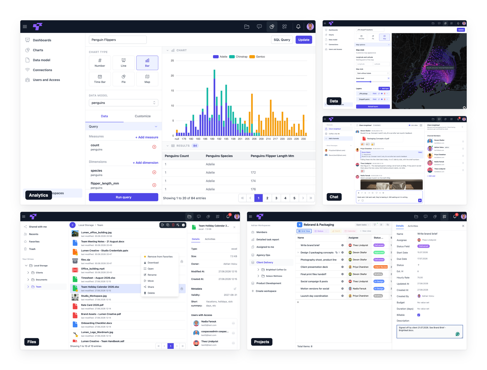
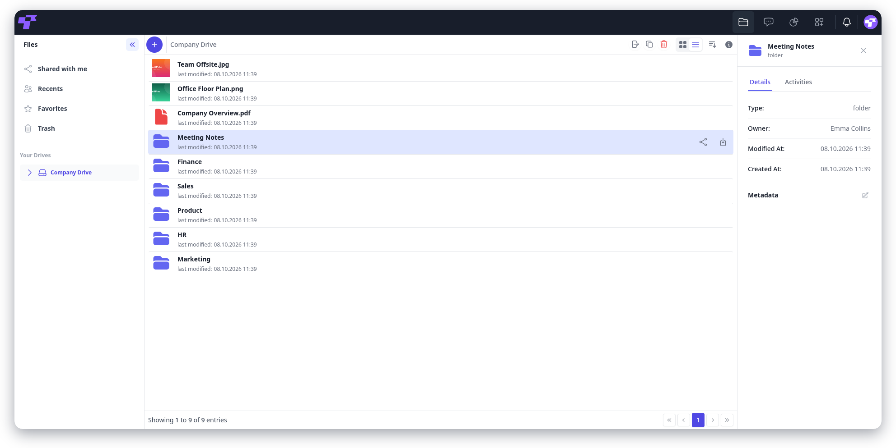
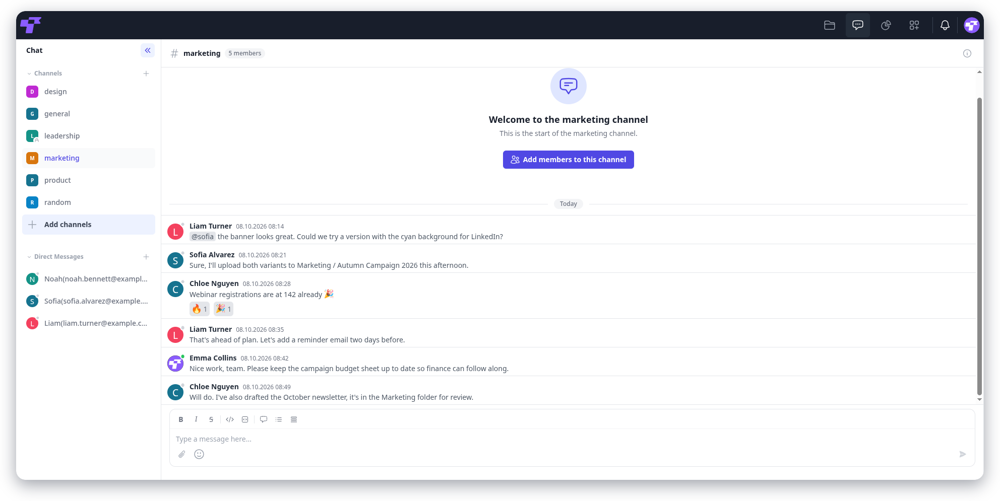
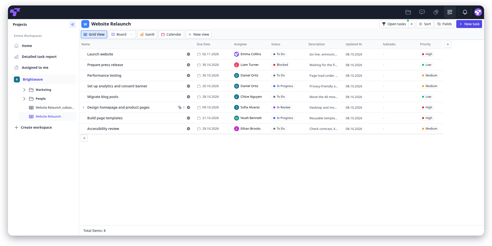
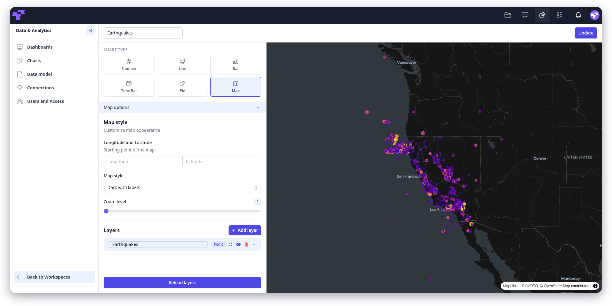

<div align="center">


<h1>Twigex</h1>

<p><strong>One space for all your work.</strong><br/>
Files, chat and video, projects, and a BI tool for teams, in a single self-hosted Go binary you can also deploy on Kubernetes.</p>

<p>
<a href="LICENSE"></a>  <a href="https://go.dev"></a> <a href="https://vuejs.org"></a> <a href="https://artifacthub.io/packages/helm/twigex/twigex"></a> <a href="https://www.twigex.com"></a>
</p>

<p>
  <a href="#quick-start"><strong>Quick start</strong></a> ·
  <a href="https://demo.twigex.com/"><strong>Live demo</strong></a> ·
  <a href="https://twigex.com/"><strong>Docs</strong></a>
</p>

<br/>



</div>

---

> [!NOTE]
> Try it right now, with no signup and no setup. It's the same version you'd self-host: **[demo.twigex.com](https://demo.twigex.com/)**,
> username `twigex`, password `twigex`. The demo resets every 30 minutes, so don't put anything real in it.

Instead of switching between a file drive, a task tracker, a chat app, and a BI tool, teams get one platform for content, processes, and data, deployable on your own infrastructure with full data isolation.

## Table of contents

- [What's in it](#whats-in-it)
  - [Files](#files)
  - [Chat & video](#chat--video)
  - [Projects](#projects)
  - [Collimato](#collimato)
- [Who it's for](#who-its-for)
- [Editions](#editions)
- [Requirements](#requirements)
- [Quick start](#quick-start)
  - [Option A: Single binary](#option-a-single-binary)
    - [First-boot behaviour](#first-boot-behaviour)
  - [Option B: Docker Compose](#option-b-docker-compose)
  - [Option C: Helm / Kubernetes](#option-c-helm--kubernetes)
- [Building from source](#building-from-source)
- [Documentation & links](#documentation--links)
- [Licensing](#licensing)
- [Contributing](#contributing)
- [Security](#security)

## What's in it

### Files

Upload, organise and tag files with metadata. Share with individual users or groups, or publish read-only public links. Storage is local disk or S3-compatible object storage, and several backends can be configured at once. MS Office-compatible documents open in EuroOffice or Collabora, where several people can edit them at the same time.



### Chat & video

Channels and direct messages with reactions, mentions and link previews, linked directly to tasks and files. Video calls and scheduled meetings run through LiveKit. Guests can be invited to a channel by link without an account.



### Projects

Plan work in tables of tasks with custom fields, subtasks and links between tables, shown as a grid, kanban board, Gantt chart or calendar. Access is controlled per workspace, and optionally per table.



### Collimato

Connect a database or API, model and transform your data, and build dashboards and charts.



> [!IMPORTANT]
> Twigex is in active development and has **not reached 1.0**. It is used in production, but interfaces and configuration may still change between releases.

## Who it's for

Built for teams of any size and industry, such as marketing, HR, freelancers, and development teams, as well as government and public-sector deployments that need full digital autonomy over their data. Deploy it in the cloud, hybrid, or fully self-hosted / on-premises.

<p align="right"><a href="#twigex">Back to top</a></p>

## Editions

- **Community Edition:** free, self-hosted, core collaboration functionality. The single binary, [Docker Compose](https://github.com/twigex/twigex-docker-compose) and the [Twigex Helm chart](https://github.com/twigex/twigex-helm-chart) all deploy this edition.
- **Enterprise Edition:** on-prem, hybrid, or cloud, with support, customization, and complete data-isolation controls. [Contact Twigex](https://twigex.com/) for pricing.

## Requirements

| Service                 |                                               |
| ----------------------- | --------------------------------------------- |
| MySQL 8 or MariaDB      | **required**                                  |
| Redis                   | **required**, used for sessions               |
| LiveKit                 | optional, needed for video calls and meetings |
| Cube.js                 | optional, needed for Collimato                |
| EuroOffice or Collabora | optional, needed for document editing         |

The server will not start without a reachable database and Redis. The optional services are only contacted when their feature is used, so you can add them later.

## Quick start

You can run Twigex as a single binary, with Docker Compose, or via the official Helm chart on Kubernetes.

### Option A: Single binary

Put your configuration in an env file and start the server. On first boot Twigex runs its database migrations, creates the storage backend, and creates the administrator account.

**1. Configure** `/etc/twigex/env` (`chmod 600`, keep it out of version control):

```sh
TWIGEX_DB_HOST=localhost
TWIGEX_DB_PORT=3306
TWIGEX_DB_NAME=twigex
TWIGEX_DB_USER=twigex
TWIGEX_DB_PASSWORD=

TWIGEX_ADMIN_NAME=Jane
TWIGEX_ADMIN_LASTNAME=Doe
TWIGEX_ADMIN_USERNAME=jane
TWIGEX_ADMIN_EMAIL=jane@example.com
TWIGEX_ADMIN_PASSWORD=

TWIGEX_STORAGE_TYPE=local

# The public address users reach. Used for links in emails, public shares and
# SSO redirects, so it must be the proxy's address, not the app's.
TWIGEX_SERVER_SITE_URL=https://twigex.example.com

# Encrypts storage credentials at rest. Generate once and keep it: openssl rand -hex 16
TWIGEX_SERVER_ENCRYPT_KEY=

# The reverse proxy's address, so forwarded client IPs are trusted from it.
TWIGEX_TRUSTED_PROXIES=127.0.0.1
TWIGEX_TRUSTED_PROXY_HEADERS=X-Forwarded-For
```

Redis is required and defaults to `localhost:6379`. Set `TWIGEX_REDIS_ADDRESS` if
it lives elsewhere.

**2. Start**:

```sh
./twigex start --port 3000
```

**3. Put a reverse proxy in front of it.** Twigex serves plain HTTP and expects
TLS to terminate at nginx, Caddy, or your load balancer. Proxy to `127.0.0.1:3000`
and forward websockets: chat, calls and live updates need `Upgrade` and
`Connection` passed through.

The server can also terminate TLS itself, which is useful when there is no proxy:

```sh
./twigex start --port 3000 --cert path/to/cert --key path/to/key
```

#### First-boot behaviour

The three bootstrap steps only run when there is nothing to do, so restarting is safe and the environment variables can be removed afterwards:

- **Migrations** run on every start, and are skipped when already applied.
- **Storage** is created from `TWIGEX_STORAGE_*` only when no storage exists yet. For S3, set `TWIGEX_STORAGE_TYPE=s3` plus `ENDPOINT`, `BUCKET`, `ACCESS_KEY`, `SECRET_KEY`, and optionally `SSL=false` and `NAME`. The secret key is encrypted before it is stored.
- **The administrator** is created from `TWIGEX_ADMIN_*` only when no users exist. All five variables must be set together, or startup fails rather than creating a half-configured account.

Everything else is configured in the admin settings once you are signed in.

### Option B: Docker Compose

A single-node stack with Twigex, its database, Redis and the EuroOffice document
server, brought up by one `docker compose up -d` on any Linux host with Docker
Engine 20.10+. Every editable value lives in one `.env` file, and a script
generates the secrets for you.

Clone the repository and follow its README:

[github.com/twigex/twigex-docker-compose](https://github.com/twigex/twigex-docker-compose)

### Option C: Helm / Kubernetes

Requires **Helm v3.8+** and a **Kubernetes 1.24+** cluster.

```sh
helm install twigex oci://ghcr.io/twigex/helm-charts/twigex \
  --namespace twigex --create-namespace \
  --set domain=example.com \
  --set ingress.enabled=true \
  --set twigex.admin.password=your_password \
  --set twigex.server.encryptKey=$(openssl rand -hex 16) \
  --set mariadb.password=your_mariadb_password \
  --set mariadb.rootPassword=your_mariadb_root_password \
  --set redis.auth.password=your_redis_password
```

The example above is minimal. The full install guide, covering embedded and
external MariaDB modes, TLS, LiveKit (voice/video), and EuroOffice/Collabora
(office editing), lives in the chart repository and its documentation:

[github.com/twigex/twigex-helm-chart](https://github.com/twigex/twigex-helm-chart)

The [Twigex manual](https://twigex.com/en/Installation) covers the install
options in more detail.

<p align="right"><a href="#twigex">Back to top</a></p>

## Building from source

Requires **Go 1.26** and **Node 22.12 or newer**.

```sh
make build
```

That compiles the server, builds the frontend, and produces a release archive in `build/`. To compile only the binary:

```sh
make compile
```

For frontend development, run the server on port 3000 and start the Vite dev server alongside it. Vite proxies `/api` and websocket traffic through to the server, so open the URL Vite prints rather than port 3000.

```sh
cd frontend && npm install && npm run dev
```

See [the backend guidelines](docs/development/backend.md) for the conventions this codebase follows, and [the testing guide](docs/development/testing.md) for how to run the test suites.

## Documentation & links

- 📖 Manual: [twigex.com/en/Installation](https://twigex.com/en/Installation)
- 🏢 Website: [twigex.com](https://twigex.com/)
- 📦 Artifact Hub: [artifacthub.io/packages/helm/twigex/twigex](https://artifacthub.io/packages/helm/twigex/twigex)

## Licensing

Copyright (c) 2022 Twigex, SIA. Licensed under the [GNU Affero General Public
License v3.0 only](LICENSE). Third-party licences are listed in [NOTICE](NOTICE).

## Contributing

Issues and pull requests are welcome. Start with [CONTRIBUTING.md](CONTRIBUTING.md), which covers the development setup, tests, migrations, translations and the pull request checklist. Then read [the backend guidelines](docs/development/backend.md), which covers the architecture, error handling, logging and i18n conventions; a change that ignores them will need rework.

## Security

Please **do not** open a public issue for security problems. Report them to **security@twigex.com**. See [SECURITY.md](SECURITY.md) for what to include.

---

<div align="center">
<sub>Made by <a href="https://www.twigex.com">Twigex</a></sub>
</div>
